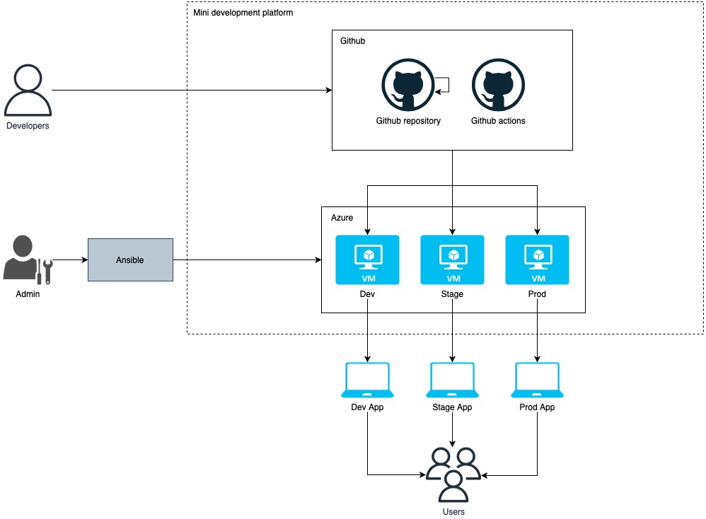
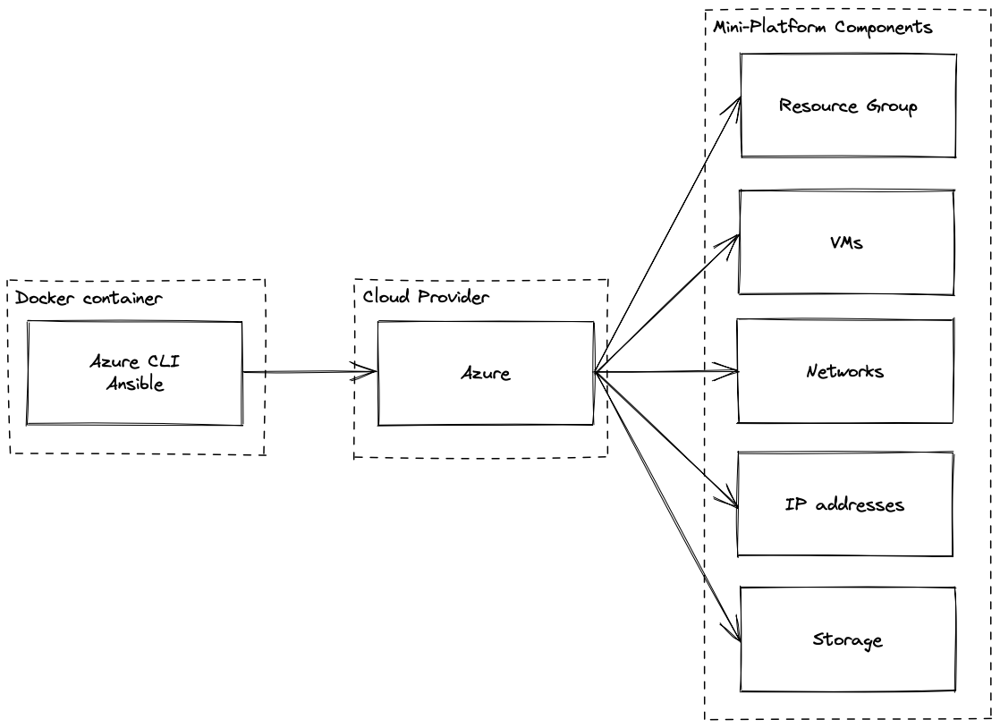

                                        _       _ 
                              _ __ ___ (_)_ __ (_)
                             | '_ ` _ \| | '_ \| |
                             | | | | | | | | | | |
                             |_| |_| |_|_|_| |_|_|
                                                  
              _                _                                  _   
           __| | _____   _____| | ___  _ __  _ __ ___   ___ _ __ | |_ 
          / _` |/ _ \ \ / / _ \ |/ _ \| '_ \| '_ ` _ \ / _ \ '_ \| __|
         | (_| |  __/\ V /  __/ | (_) | |_) | | | | | |  __/ | | | |_ 
          \__,_|\___| \_/ \___|_|\___/| .__/|_| |_| |_|\___|_| |_|\__|
                                      |_|                             
                         _       _    __                      
                   _ __ | | __ _| |_ / _| ___  _ __ _ __ ___  
                  | '_ \| |/ _` | __| |_ / _ \| '__| '_ ` _ \ 
                  | |_) | | (_| | |_|  _| (_) | |  | | | | | |
                  | .__/|_|\__,_|\__|_|  \___/|_|  |_| |_| |_|
                  |_|                                         

Welcome to the Mini Development Platform!

This project aims to provide a streamlined and efficient way for developers to create and deploy Python applications. Whether you are a beginner looking to learn the basics of Python development or an experienced developer looking to streamline your workflow, this platform has something to offer.

## Architecture


## Provisioning
Build and run docker container with Azure CLI and Ansible.
```sh
# Build image with Azure cli and ansible
docker build --no-cache -t manage-infra:1.0 .

# Run container
docker run -it --name mini-platform-managment manage-infra:1.0

# Login to Azure
az login
```



## Prerequsities
- Azure subscription
- Domain and subdomains: dev.* test.*
- Github account
- Installed docker

## Naming convention
| Name             |       Destination       |
|------------------|-------------------------|
| dev.appname.com  | development environment |
| test.appname.com |       Stage environment |
| appname.com      |  Production environment |

## Get started with Mini Development Platform
**How to run the platform?**

Azure + Ansible

Build image with Azure CLI and ansible
```sh
docker build -f PATH_TO_DOCKERFILE -t NAME:TAG 
```
Start a container with Azure CLI and ansible
```sh
docker run --name CONTAINER_NAME -ti NAME:TAG 
```
Login to Azure
```sh
az login
```
Run below command
```sh
# Go to project dir
cd mini-platform

# Create a dir for ssh keys
mkdir ssh_keys
```
Run ansible playbook
```sh
ansible-playbook -i hosts -vvv mini-platform.yaml
```
## Clean up
Run following command and clean all resources which was created in previous steps
```sh
ansible-playbook delete_rg.yml --extra-vars "name=<resource_group>"
```

Project in progress... :)
